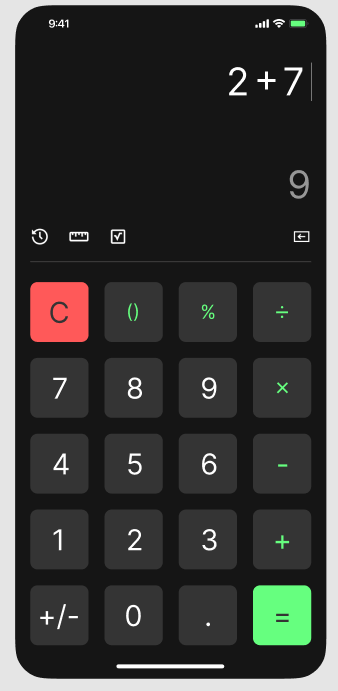

# Simple Calculator

A basic calculator web app built with **HTML**, **CSS**, and **JavaScript**. It supports simple arithmetic operations: addition, subtraction, multiplication, and division.

## Features

- Responsive user interface
- Supports basic arithmetic operations
- Keyboard and button input

## Getting Started

1. **Clone the repository:**
    ```bash
    git clone https://github.com/your-username/simple-calculator.git
    ```
2. **Navigate to the project folder:**
    ```bash
    cd simple-calculator
    ```
3. **Open `index.html` in your browser.**

## File Structure

```
simple-calculator/
├── index.html
├── style.css
└── script.js
└── README.md
```

## Usage

- Enter numbers and operators using the buttons or your keyboard.
- Click `=` to see the result.
- Use `C` to clear the input.

## Screenshots



